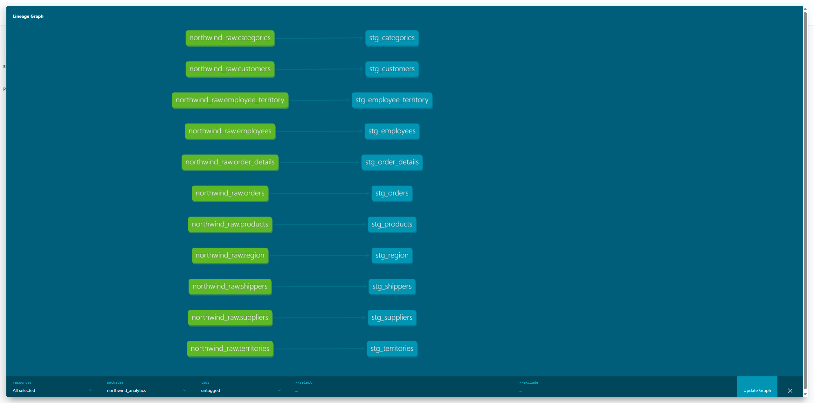

# Retail Analytics — PostgreSQL + dbt Core + Power BI + R stats

## Progress (so far)
- Set up a dbt Core project (`northwind_analytics`) connected to PostgreSQL (Northwind loaded from Kaggle CSVs).
- Defined dbt sources for the raw Northwind tables (so models reference data via `source()`).
- Built the initial staging layer (11 staging models) to standardize column naming and prepare clean, consistent tables/views for analytics.

## Next
- Add data quality tests in dbt (primary keys, foreign keys, not-null, uniqueness, relationships) based on the ER diagram.
- Fix/standardize data types in staging (e.g., cast date fields like `requireddate`/`shippeddate`).
- Finalize type cleaning (e.g., date fields) and build marts (facts/dimensions) for Power BI dashboards and R-based statistical analysis.

## Business goal
Build a clean, tested analytics dataset (dbt + PostgreSQL) and a Power BI report that tracks sales and fulfillment performance using clearly defined KPIs.

## Business questions
- How are sales trending over time (monthly/quarterly)?
- Which products/categories and customers drive the most revenue?
- How reliable is order fulfillment (on-time shipping, shipping lead time)?
- Are there differences by shipper, employee, or region?

## KPI definitions (initial)
> Note: Northwind does not include true cost, so KPIs focus on revenue and operations.

**Sales**
- Total Revenue = Σ(unit_price * quantity * (1 - discount))
- Orders = count distinct(order_id)
- Units Sold = Σ(quantity)
- Average Order Value (AOV) = Total Revenue / Orders
- Discount Rate (optional) = Σ(unit_price * quantity * discount) / Σ(unit_price * quantity)

**Fulfillment**
- On-time Shipping % = shipped_date <= required_date (for shipped orders)
- Avg Shipping Lead Time (days) = avg(shipped_date - order_date)
- Late Shipments = count where shipped_date > required_date

## Storytelling (Power BI report outline)
- Page 1: Executive Overview — Revenue, Orders, AOV, On-time %, trends
- Page 2: Sales Drivers — Revenue by category/product, top customers
- Page 3: Fulfillment Health — On-time % by shipper, lead time trends, late orders

## Dataset
**Dataset:** Northwind (multi-table retail; https://www.kaggle.com/datasets/matthuan/northwind-dataset/data).  
**DB:** PostgreSQL (pgAdmin).  
**Tables used:** categories, customers, employees, employee_territories, order_details, orders, products, region, shippers, suppliers, territories.

**Quick links**
- ER diagram: `figs/northwind-erd.png`
- dbt lineage (staging): `figs/dbt-lineage-staging.png`

## Data model (ER Diagram)
<details>
  <summary>View ER diagram</summary>

  

</details>

## dbt Lineage (DAG)
<details>
  <summary>View dbt lineage graph</summary>

  

</details>

## Data quality checks (dbt tests)
This project uses dbt tests to validate both structural integrity (PK/FK) and basic business rules so KPI inputs remain reliable.

**Key integrity**
- Primary keys: `not_null` + `unique` (e.g., `stg_orders.order_id`)
- Foreign keys: `not_null` + `relationships` (e.g., `stg_orders.customer_id → stg_customers.customer_id`)

**Business rules**
- `required_date >= order_date`
- `shipped_date >= order_date`
- (More rules will be added as marts/dimensions are built)

## Repo layout
- `northwind_analytics/` – dbt Core project (sources, models, tests, docs)
- `sql/` – sanity checks / ad-hoc analysis queries (optional, not the dbt models)
- `r/` – conditional probabilities + hypothesis tests (t-test / prop test) + analysis between variables + linear regression
- `powerbi/` – report (`.pbix`) or screenshots exported to `figs/`
- `figs/` – images/screenshots for README (charts, dbt docs lineage, Power BI screenshots)
- `data/raw/` – CSVs (kept out of Git)

## How to run (PostgreSQL + pgAdmin + dbt Core)

### 1) Create database
pgAdmin → **Databases → Create → Database…** → name: `northwind`

### 2) Import the CSV tables into Postgres
Import the Kaggle CSVs into the `public` schema (tables listed above).

### 3) Run dbt (build clean models + tests)
From the repo root:
```bash
cd northwind_analytics
dbt debug
dbt run
dbt test
